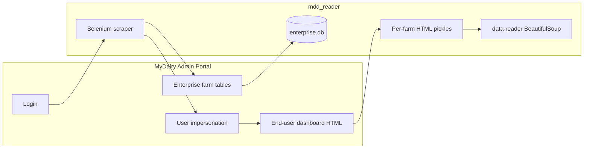

# Project overview — mdd_reader

**Document type:** product and technical overview  
**Audience:** engineers, analysts, and stakeholders integrating with My Dairy Dashboard (MDD) data

---

## Problem statement

Organizations that support dairy operations often rely on **My Dairy Dashboard** for operational and performance metrics. The **admin portal** exposes enterprise-level configuration, farm rosters, and the ability to act as (impersonate) end users to view their dashboards. Manually copying that information is slow and error-prone.

**mdd_reader** exists to **automate collection** of:

1. **Farm rosters** per enterprise (identifiers and names as shown in admin tables).
2. **Dashboard HTML snapshots** per farm account after impersonation, for downstream parsing of indicator cards and metrics.

A secondary path parses **static HTML** into structured **card titles, body text, and footers** (e.g. chart subtitles such as rolling averages), which matches how the live dashboard surfaces KPIs.

---

## Target users and use cases

| User | Use case |
|------|----------|
| Internal data / integration team | Refresh a local catalog of enterprises and farms from the admin UI. |
| Analytics / reporting | Feed parsed card text and footers into spreadsheets, databases, or BI tools. |
| Engineering | Extend Selenium flows when the portal DOM or auth flow changes. |

---

## System context (conceptual)

---

## Information gathered today

### From admin “company” pages (`companyCrawler`)

- Table rows from the enterprise detail view: cells are interpreted as **farm name** and **MDD-related identifier** (second column), then stored via `sqlAPI.addFarm(enterpriseID, mddid, farmName)`.
- Pagination is handled by clicking a “next” control until disabled or the flow exits.

### From impersonation (`impersonateUser`)

- For each enterprise, opens the **user management** URL from the database, clicks **impersonate**, switches to the new tab, accepts cookies when present, and selects each farm from a **Material dropdown** (`mat-input-0`).
- For each selection, saves **`driver.page_source`** to a **pickle** file named after the farm under an enterprise-specific folder.

### From offline HTML (`extract_card_bits` in `data-reader.py`)

- **Card title** (`.card-title`)
- **Indicator body** (`.mdd-indicator-container`)
- **Chart/footer line** (`.mdd-highcharts-footer`), e.g. period labels

Selectors assume DOM structure using `.card-container` or `mdd-indicator-card` hosts, consistent with the MyDairy dashboard front end.

---

## Data stores

| Store | Purpose |
|-------|---------|
| `enterprise.db` | Source of truth for enterprise names, admin URLs, impersonation user URLs, and the farm list keyed by enterprise. |
| Pickle files | Opaque snapshots of HTML for replay parsing without hitting the portal again. |

**Note:** The repo does not include a checked-in schema or ERD; the implied tables include `enterprise_customers`, `enterprise_user`, and `farms`.

---

## Strengths

- Clear separation between **browser automation**, **SQLite access**, and **HTML parsing**.
- Card extraction is scoped to **per-card** DOM subtrees, which reduces noise from the rest of the page.
- **webdriver-manager** reduces manual ChromeDriver maintenance.

---

## Risks and limitations

1. **Fragile selectors**: Heavy use of absolute XPath and link text (`»`, `1`) breaks when the SPA layout changes.
2. **Environment coupling**: Hardcoded OS paths and inline credentials make the project non-portable and unsafe for shared repos until refactored.
3. **SQL construction**: String interpolation in SQL helpers is a maintenance and security risk; parameterized queries are preferred.
4. **Dependency drift**: `install.txt` omits `beautifulsoup4` though `data-reader.py` imports it.
5. **Missing sample assets**: `data-reader.py` references a local HTML file that is not in the repository; new contributors need a sample or instructions to export HTML from the browser.

---

## Suggested roadmap (prioritized)

1. **Secrets and config**: Move login, base URLs, and filesystem roots to environment variables or a ignored config module; document required variables in `README.md`.
2. **Dependencies**: Replace `install.txt` with `requirements.txt` (pinned versions) including `beautifulsoup4`.
3. **Stability**: Replace brittle XPath with stable `data-testid` or role-based selectors if the app provides them; add explicit waits tied to visible table rows.
4. **Safety**: Parameterize all SQL in `sqlAPI.py`.
5. **Testing**: Add a **fixture HTML** file and unit tests for `extract_card_bits`.
6. **Output format**: Optionally write JSON or Parquet alongside pickles for easier pipelines; keep pickles optional for debugging.

---

## Success metrics (for future iterations)

- Time to refresh full enterprise + farm catalog vs manual process.
- Parse success rate on indicator cards (non-empty title/footer) from saved HTML.
- Number of manual fixes required per portal release (proxy for selector stability).

---

## Glossary

| Term | Meaning |
|------|---------|
| **MDD** | My Dairy Dashboard — product context for the scraped UI. |
| **Admin portal** | `admin.mydairydashboard.com` — enterprise and user administration. |
| **Impersonation** | Admin action that opens the dashboard as a specific end user / farm account. |
| **Indicator card** | Dashboard widget showing a metric, often with a Highcharts footer line. |
