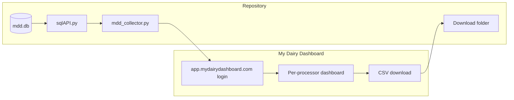

# Project overview — mdd_reader

**Scope:** This overview applies only to **`install.txt`**, **`mdd_collector.py`**, **`sqlAPI.py`**, and **`mdd.db`**.

**Audience:** anyone running or extending the My Dairy Dashboard CSV download automation.

---

## Problem

My Dairy Dashboard exposes per-farm data in the web app. Copying CSVs manually for many farms and processors is slow. **mdd_reader** automates login, navigation, and CSV download using the same UI a user would.

---

## What runs today

1. **`sqlAPI.list_of_processors()`** reads **`dashboards`** in **`mdd.db`** and returns `(id, url)` rows.
2. **`mdd_collector.py`** logs into **https://app.mydairydashboard.com**, then for each processor builds  
   `https://app.mydairydashboard.com/dashboards/<url>`.
3. For each farm name from **`sqlAPI.get_farm_info_for_processor(processor_id)`** ( **`farms`** table ), the script selects that farm in the Material autocomplete, opens the weight column header menu, and clicks the menu item whose label matches **`MDD_DOWNLOAD_MENU_TEXT`** (default **Download CSV**).
4. Chrome saves files under **`MDD_DOWNLOAD_DIR`** (default **`mdd_downloads`**). The script waits until Chrome finishes (no `*.crdownload`).

---

## System context

---

## Data store (`mdd.db`)

| Table | Used for |
|-------|----------|
| `dashboards` | Processor id and URL segment for `/dashboards/<url>`. |
| `farms` | Farm names keyed by `processor_id` for the dropdown loop. |

The exact column list may evolve; align **`sqlAPI.py`** queries with your schema.

---

## Strengths

- **webdriver-manager** reduces manual ChromeDriver setup.
- Menu actions target **visible** Material menu rows by label, avoiding a single hard-coded overlay panel id when **`MDD_MENU_PANEL_ID`** is unset.
- Download wait ignores in-progress **`*.crdownload`** files so completion is detected reliably.

---

## Risks and limitations

- **DOM coupling**: Selectors (Material classes, `#mat-input-0`, column header CSS) can break when the app updates.
- **SQL in `sqlAPI.py`**: Farm lookup uses string formatting for the id; parameterized SQL is safer when extending.
- **Timing**: Some steps still use fixed sleeps; flaky networks or slow renders may need longer waits or explicit conditions.

---

## Related documentation

- **[README.md](./README.md)** — install, run, environment variables.
- **[prompt.md](./prompt.md)** — short AI / contributor context for the same four artifacts.
